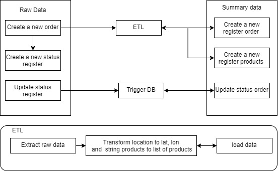

# CRUD_test
1. Aquí cree dos entitdades
llamadas Orden y OrdenEstado haciendo referencia al esquema raw_data en la base datos y las tablas orden y estado respectivamente.
```python
@dataclass
class Orden:
    id: int = None
    ubicacion: str = None
    nombre_cliente: str = None
    nombre_operador: date = None
    productos: list = None
    created_at: datetime = None
    updated_at: datetime = None
    delivered_at: datetime = None

@dataclass
class OrdenEstado:
    id: int = None
    orden_id: int = None
    estado: int = None
    tiempo_estado: str = None
    timestamp: datetime = None 

```
La lógica de la base de datos se describe la siguiente figura:



Cuando un registro de una orden se realiza, se crea un estado asociado y esa registro pasa por un proceso de ETL para transformar los datos y cargar el base de datos summary_data. En esta ultima base de datos, hay dos tablas ordenes y productos donde se carga la data procesada.

Usando flaskAPI, se crea 4 end-ponts /orden/crear para crear una nueva orden, /orden/eliminar eliminar una orden basado en su id, /orden/list para enlistar las ordenes, /orden/actualizar/ modificar alguna orden y por ultimo /orden/estado/actualizar para cambiar el estado de la orden.

2. Google Looker Studio
Enlaces: https://lookerstudio.google.com/reporting/ea84de1d-c26b-4bd3-af4a-639c64112a5e

3. Para garantizar la escalabilidad proponemos la arquictectura debajo mostrada.

En esta consideramos en balaceandor de carga con varios servidores corriendo la REST api. Esta datos son directamentes escritos en la base de datos el cual va acumulando información hasta que sea llego a una partición al maximo registros por worker (por ejemplo, 10000 registros por worker) cuando llegue a ese valor se extraen se activan un trigger en Airflow que coloca en la cola de redis para que estos sean ejecutdaos por worker celery en paralelo.


